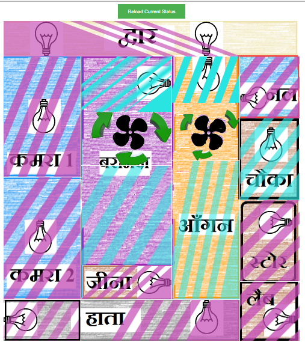
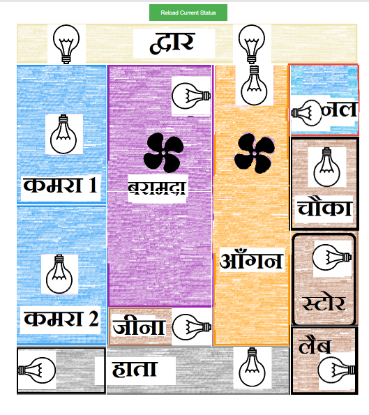
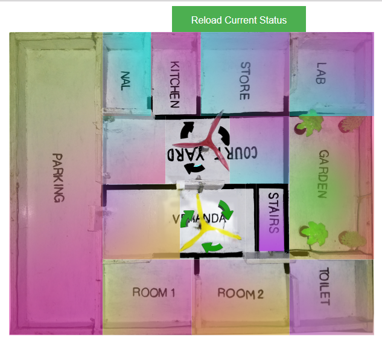
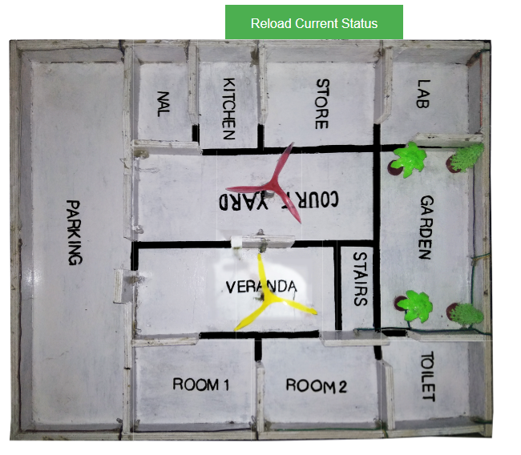
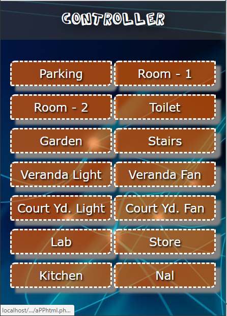
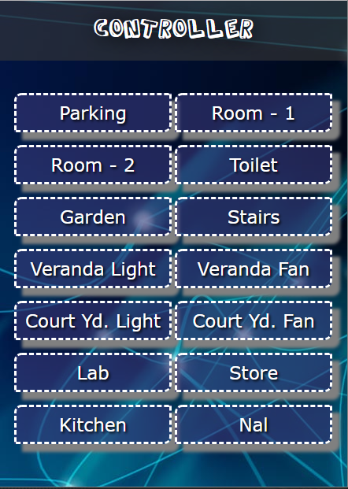
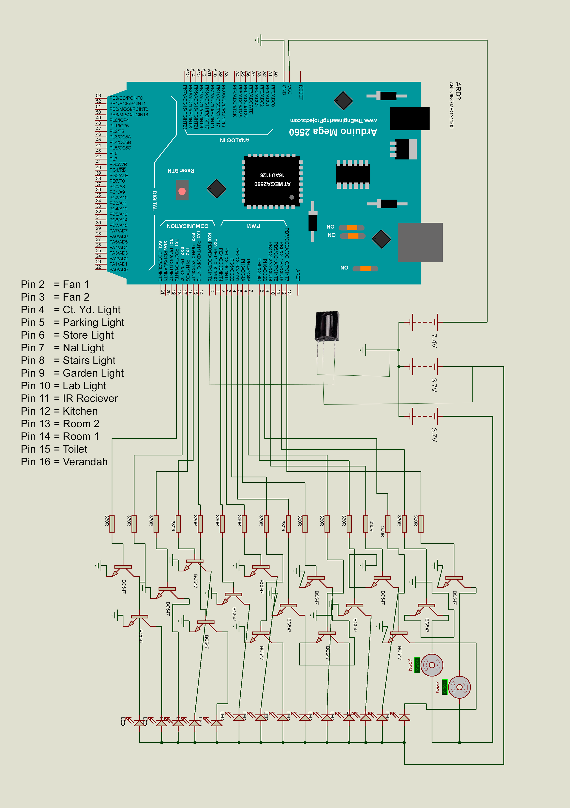
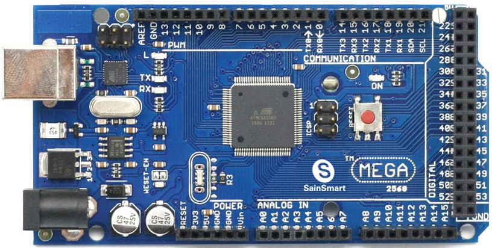

# homeAutomation

A project with a physical model of My home and its Electronic, To be controlled with Android app, Web App, Hindi Voice Control and IR Remote. 

### Physical Model

### Web App Style 1 On and Off

 

### Web App Style 2 On and Off

 

### Android App On and Off

 

### Cicuit Diagram

 

